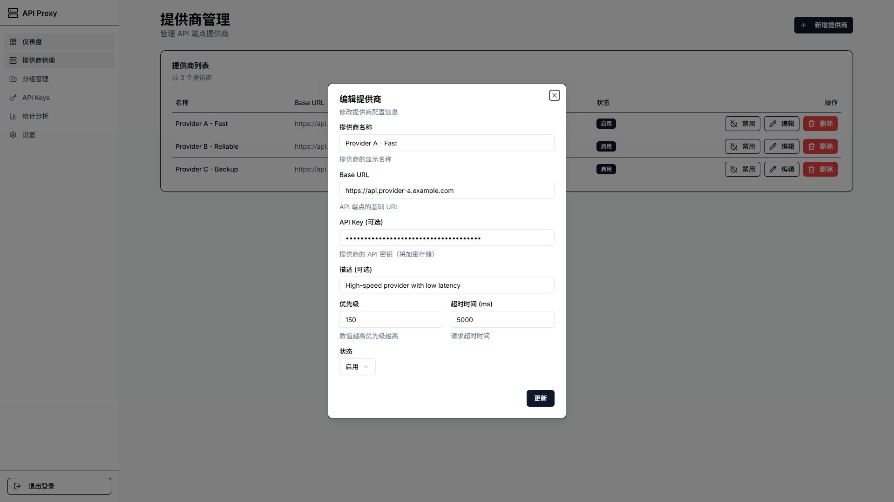

# API 代理轮询系统

> [!WARNING]
> ⚠ 注意：这不是一个可用的项目。只是我用于实践ai编码能力的一个测试项目。如需使用，请自行评估安全性和适用性。
> 本项目 100% 由 AI 生成，只保证可以运行，可能包含错误或不安全的代码。请谨慎使用。
> 包括各种文档和注释在内的所有内容均由 AI 生成，未经人工审核。

高可用的 API 聚合和负载均衡系统，基于 Next.js 15、Drizzle ORM、Redis 和 TypeScript 构建。

## 特性

- ✅ **智能负载均衡** - 基于权重和健康状态的轮询算法
- ✅ **自动故障转移** - 自动检测和切换故障节点
- ✅ **速率限制** - 灵活的 API 访问控制
- ✅ **健康监控** - 实时监控 Provider 状态和性能
- ✅ **管理后台** - 可视化管理 Providers、Groups 和 API Keys
- ✅ **多租户支持** - 支持全局和分组级别的 API Keys

## 技术栈

- **框架**: Next.js 15 (App Router)
- **语言**: TypeScript 5.7
- **数据库**: SQLite / PostgreSQL + Drizzle ORM
- **缓存**: Redis (ioredis)
- **认证**: NextAuth.js v5
- **UI**: Tailwind CSS 4 + shadcn/ui
- **包管理**: pnpm

## 快速开始

### 环境要求

- Node.js >= 18.17.0
- pnpm >= 8.0.0
- Redis >= 7（推荐使用 [Upstash](https://upstash.com/) 或本地 Redis）

### 安装依赖

```bash
pnpm install
```

### 配置环境变量

复制 `.env.example` 到 `.env` 并配置必要的环境变量：

```bash
cp .env.example .env
```

**最小配置示例**：

```env
# 数据库配置（开发环境使用 SQLite）
DATABASE_URL="file:./dev.db"

# Redis 配置
REDIS_URL="redis://localhost:6379"

# NextAuth 配置（生成随机密钥：openssl rand -base64 32）
NEXTAUTH_SECRET="your-secret-key"
NEXTAUTH_URL="http://localhost:3000"

# 加密配置（生成随机密钥：openssl rand -base64 32）
ENCRYPTION_KEY="your-encryption-key"
```

### 数据库迁移

```bash
pnpm db:push
```

### 创建测试 API Key（可选）

```bash
npx tsx -r dotenv/config scripts/create-test-api-key.ts
```

### 启动开发服务器

```bash
pnpm dev
```

访问 <http://localhost:3000>

## 项目结构

```text
├── app/                    # Next.js App Router
│   ├── api/               # API Routes
│   ├── admin/             # 管理后台
│   └── globals.css        # 全局样式 (Tailwind CSS 4)
├── components/            # React 组件
│   └── ui/               # shadcn/ui 组件
├── lib/                   # 工具函数
├── schema/                # Drizzle ORM schemas
├── types/                 # TypeScript 类型定义
├── hooks/                 # 自定义 React Hooks
├── drizzle/              # 数据库迁移文件
└── public/               # 静态资源
```

## 使用说明

### 1. 配置 Providers

访问管理后台 `http://localhost:3000/admin/providers` 添加 API Provider：

- **Name**: Provider 名称（如 "OpenAI"）
- **Base URL**: API 基础 URL（如 `https://api.openai.com`）
- **API Key**: Provider 的 API 密钥（将被加密存储）
- **Timeout**: 请求超时时间（毫秒）

### 2. 创建 Groups

访问 `http://localhost:3000/admin/groups` 创建 Provider 分组：

- **Name**: 组名（如 "Production"）
- **Slug**: URL 标识符（如 `prod`，用于 API 路径）
- **Description**: 描述

### 3. 关联 Providers 到 Groups

为每个 Group 添加 Providers 并设置优先级：

- 优先级数值越高，被选中的概率越大
- 系统会根据健康状态动态调整权重

### 4. 创建 API Keys

访问 `http://localhost:3000/admin/api-keys` 创建访问密钥：

- **Global Keys**: 可访问所有 Groups
- **Group-specific Keys**: 只能访问特定 Group

### 5. 使用代理

使用创建的 API Key 调用代理端点：

```bash
curl -X POST http://localhost:3000/api/proxy/{group-slug}/v1/chat/completions \
  -H "Authorization: Bearer your-api-key" \
  -H "Content-Type: application/json" \
  -d '{
    "model": "gpt-4",
    "messages": [{"role": "user", "content": "Hello"}]
  }'
```

**响应头说明**：

- `X-Proxy-Provider`: 处理请求的 Provider 名称
- `X-Proxy-Response-Time`: Provider 响应时间（毫秒）
- `X-RateLimit-Remaining`: 剩余请求次数

## 可用脚本

- `pnpm dev` - 启动开发服务器
- `pnpm build` - 构建生产版本
- `pnpm start` - 启动生产服务器
- `pnpm lint` - 运行 ESLint
- `pnpm lint:fix` - 自动修复 ESLint 问题
- `pnpm format` - 格式化代码（Prettier）
- `pnpm type-check` - TypeScript 类型检查
- `pnpm db:generate` - 生成数据库迁移文件
- `pnpm db:push` - 应用数据库迁移
- `pnpm db:studio` - 打开 Drizzle Studio（数据库 GUI）

## 文档

- **[部署指南](./DEPLOYMENT.md)** - 详细的部署步骤和生产环境配置
- **[开发指南](./CLAUDE.md)** - 开发规范、架构说明和最佳实践

## License

MIT

## 运行截图





